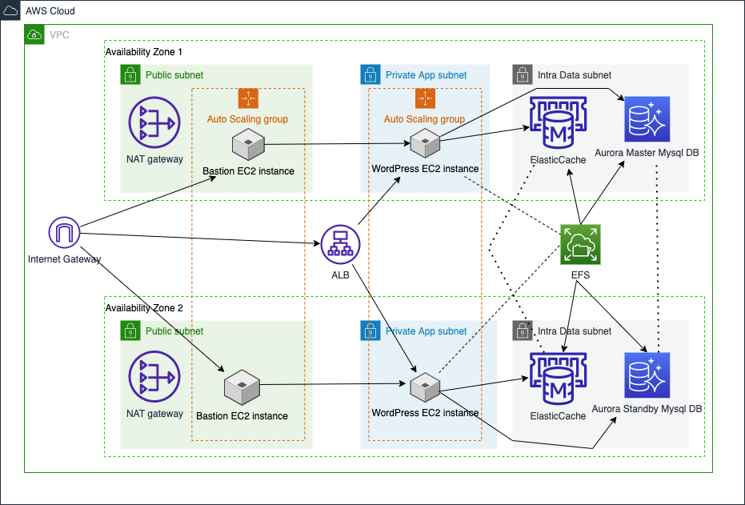

# terraform_app

Deploy with terraform WordPress HA with scalability

Infrastructure:


## Prerequisites

- Terraform
- Aws-cli

## Build steps
Change your aws_access_key and aws_secret_key at terraform.tfvars and run:

```bash
terraform init
terraform plan
terraform apply
```

## Modules

### VPC Module

- [vpc module](https://registry.terraform.io/modules/terraform-aws-modules/vpc/aws/latest)
- Public, Private and Intra subnets
- Gateway

### Db Module

- Aurora Cluster DB, there are two instances
- EFS, shared filesystem mounted in all Wordpress servers and with worpress configuration.
- ElastiCache for Memcached.

### Wp Module

- The last launch module. It's going to be launch after vpc and db modules.
- Application load balancer.
- Autoscaling group.
- Bastion servers to connect to Wordpress machines.
- Launch Configuration which uses user_data.tpl to install Apache, Wordpress and php7.2.

Based on [AWS workshop](https://ha-webapp.workshop.aws/introduction/overview.html).